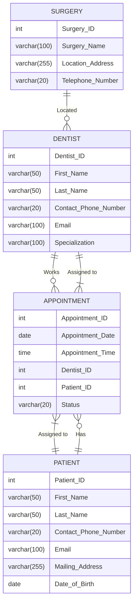

```mermaid


erDiagram
    DENTIST {
        int Dentist_ID
        varchar(50) First_Name
        varchar(50) Last_Name
        varchar(20) Contact_Phone_Number
        varchar(100) Email
        varchar(100) Specialization
    } 

    PATIENT {
        int Patient_ID
        varchar(50) First_Name
        varchar(50) Last_Name
        varchar(20) Contact_Phone_Number
        varchar(100) Email
        varchar(255) Mailing_Address
        date Date_of_Birth
    } 

    APPOINTMENT {
        int Appointment_ID
        date Appointment_Date
        time Appointment_Time
        int Dentist_ID
        int Patient_ID
        varchar(20) Status
    } 

    SURGERY {
        int Surgery_ID
        varchar(100) Surgery_Name
        varchar(255) Location_Address
        varchar(20) Telephone_Number
    } 

    DENTIST ||--o{ APPOINTMENT : "Works"
    PATIENT ||--o{ APPOINTMENT : "Has"
    APPOINTMENT }|--|| DENTIST : "Assigned to"
    APPOINTMENT }|--|| PATIENT : "Assigned to"
    SURGERY ||--o{ DENTIST : "Located"


```